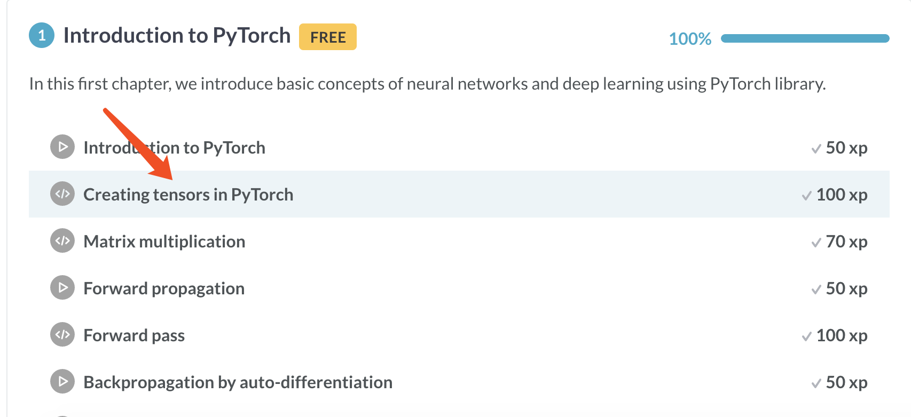

```{r, include = FALSE}
knitr::opts_chunk$set(
  collapse = TRUE,
  comment = "#>"
)
```

```{r setup}
library(add2datacamp)
```


{ width=100% }


{ width=100% }


{ width=100% }


{ width=100% }


{ width=100% }

```r
add2datacamp::download_datacamp_slides("https://s3.amazonaws.com/assets.datacamp.com/production/course_15510/slides/chapter1.pdf")
```

```r
> fs::dir_info("analysis/winning_a_kaggle_competition_in_python/refs/")$path
analysis/winning_a_kaggle_competition_in_python/refs/chapter1.pdf
analysis/winning_a_kaggle_competition_in_python/refs/chapter2.pdf
analysis/winning_a_kaggle_competition_in_python/refs/chapter3.pdf
analysis/winning_a_kaggle_competition_in_python/refs/chapter4.pdf
```
